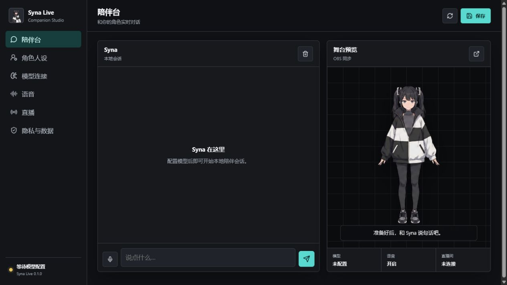

# Syna Live

Syna Live is a local-first AI companion and livestream avatar studio. Combine character art, a persona, and your own model key to create a character that can chat, speak, respond to Bilibili danmaku, and appear in an OBS browser source.

[Interactive workshop](https://2788615272-glitch.github.io/syna-live/) · [Windows releases](https://github.com/2788615272-glitch/syna-live/releases/latest) · [中文说明](README.md)



## Highlights

- Editable name, relationship, personality, speaking style, and boundaries
- A dynamic expression library with add, delete, rename, and replace controls, plus a talking avatar and transparent OBS stage
- Streaming replies, early first-segment TTS, and interruption when the user starts speaking
- Always-on-top desktop companion with text, push-to-talk, and continuous listening modes
- Switchable single-brain direct-image vision or dual-brain continuous visual context with proactive reactions
- Event-driven visual reactions plus configurable ambient remarks during stable scenes, even while the main window is in the background
- Shared conversation history between the main console and floating desktop companion
- Separate encrypted ASR and TTS credentials with OpenAI-compatible audio endpoints
- Native Volcengine TTS and BigModel ASR support with AppID, token, cluster, voice, and resource fields
- Volcengine Ark and other OpenAI-compatible model providers
- Local conversation memory and optional long-term notes
- System text-to-speech and supported browser speech input
- Optional Bilibili danmaku connection and automatic replies
- Electron `safeStorage` encryption for provider keys
- No account, telemetry, or project-hosted backend

## Run from source

Node.js 20 or newer is required.

```bash
npm install
npm start
```

Run `npm test` and `npm run check` before contributing. Code is MIT licensed. Bundled Syna artwork is CC0; see [ASSET_LICENSE.md](ASSET_LICENSE.md).
